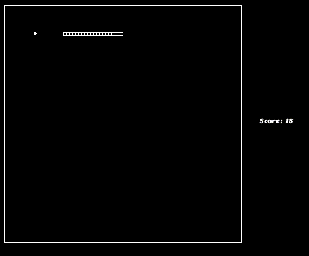

## Snake using Genetic Algorithm

## CS6023: GPU Programming project

This code uses genetic algorithm to train neural network, which predicts in which direction the snake should move.

The neural network gets 24 inputs:
- 8 : Distance of closest boundary in 8 directions
- 8 : Distance of closest food in 8 directions
- 8 : Distance to its own body in 8 directions

It has one hidden layer of 16 units.

**Files :**
- `snake-serial.cpp` : Serial C++ implementation of the game.
- `snake-parallel.cu` : CUDA implementation
- `snake-test.cpp` : C++ utility file to visualize genome.

**Instructions :**
1. Run `./install.sh` to install necessary packages. The visualization uses `graphics.h` library.
2. Run `make`.
3. Run `./snake-serial` to run the serial code with visualization of best genome after every generation.
4. Run `./snake-parallel` to run the parallel CUDA code on a GPU.
5. Copy the genomes to `genomes-best.txt` and run `./snake-test` to run the visualization on this genome.